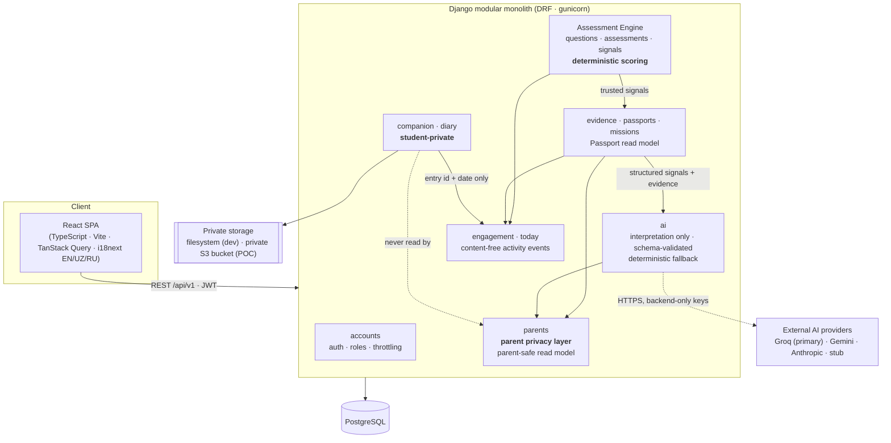

# Gifted — Architecture

A **modular monolith**: one React SPA, one Django/DRF API, one PostgreSQL database. AI providers are
external and optional. Deliberately no microservices, queues or extra infrastructure at this stage.

## Core rule: AI ≠ scoring engine

`Assessment → deterministic signals → AI interpretation`. Scores come only from
`apps/assessments/services/scoring.py` and are frozen per session (`result_snapshot`). The AI layer
(`apps/ai`) receives already-computed, source-labelled data and returns schema-validated text; if
the provider fails or the output is rejected, a deterministic fallback is used. See
`ASSESSMENT_METHOD.md`.

## Domains (`backend/apps/`)

| Domain | Responsibility |
|---|---|
| accounts | custom User (email login), roles STUDENT/PARENT/ADMIN, JWT auth, logout/revocation, account deletion |
| questions, assessments, signals | assessment content, sessions, deterministic scoring, content versioning |
| evidence | one write path for evidence from assessments/missions (idempotent) |
| passports | Passport lifecycle (EMPTY → EMERGING → GROWING) and the main read model |
| missions | server-driven missions + fixed evidence rules |
| ai | provider abstraction (Groq/Gemini/Anthropic/stub), profile synthesis, parent insight, Companion replies, traceability |
| parents | parent ↔ learner links, single-use connection codes, parent-safe overview |
| companion | the learner's private AI conversations |
| diary | the learner's private journal (text, mood, tags, stickers, photos) |
| engagement | streaks, points, badges, leaderboard, rewards — from content-free activity events |
| today | Today's Spark and in-app nudges (deterministic, no AI) |

Cross-cutting (`backend/common/`): i18n (Accept-Language → en/uz/ru), role permissions, error
envelope, request ids + structured logs, health probes, OpenAPI schema.

## Privacy boundaries (enforced in code, covered by tests)

- **Student-private:** diary (all fields and photos), Companion conversations, mission reflections,
  raw answers, Today's Spark/nudges. Never in parent endpoints, parent AI input or Django admin.
- **Parent-safe:** Passport status, journey, deterministic signals, evidence counts/dimensions,
  guidance (`apps/parents/services.py` projects the Passport read model).
- **Engagement** receives only `entry:<id>` + date from the diary, never content.

Details: `PRIVACY.md`.

## Request path and deployment

`Browser → nginx (static SPA; proxies /api, /admin, /static) → gunicorn/Django → PostgreSQL`, plus
outbound HTTPS to the AI provider. Health: `/api/v1/health/live/` (process) and
`/api/v1/health/ready/` (database; AI deliberately not required). API docs: `/api/v1/docs/`.
See `DEPLOYMENT.md`.

## Deliberate non-choices

No Celery/Redis/Kafka/Kubernetes/GraphQL: AI calls are short (≤10–30 s timeouts) with fallbacks,
and a single database is enough for a controlled pilot. The shared-cache need (throttling across
several workers) is the first thing that would justify adding Redis.
